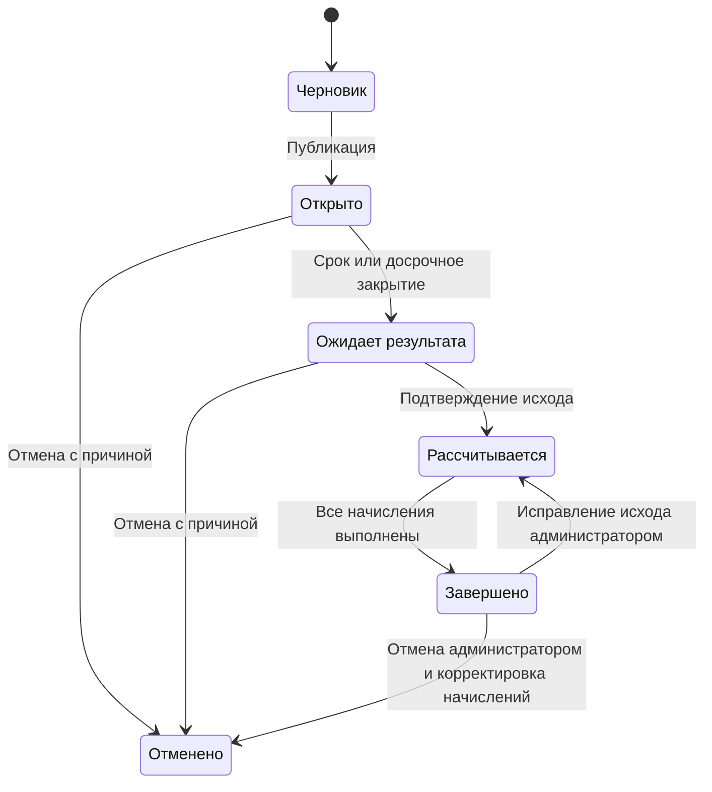

**Predictify** — веб-платформа для прогнозирования исходов событий и соревнования в рейтинге участников. Пользователь выбирает один из предложенных исходов и получает виртуальные очки за верный прогноз. Количество очков зависит от коэффициента, рассчитанного по распределению прогнозов участников.

Проект вдохновлён Polymarket. Денежные ставки, платежи и вывод средств отсутствуют. Создание прогноза не расходует виртуальные очки, а неверный прогноз не уменьшает накопленный баланс.

## Команда

**Учебная группа:** СДП-ПМАТ-241.

| Участники: |
| --- |
| Гайдук В.А. |
| Видук И.А. |
| Барашко Е.С. |
| Орлюк М.А. |

## Функциональные требования

### Роли и доступ

| Роль | Возможности |
| --- | --- |
| Гость | Просмотр категорий, событий, коэффициентов, результатов и лидерборда; регистрация, вход и восстановление пароля. |
| Зарегистрированный пользователь | Публичный просмотр, создание и изменение своего прогноза, личный кабинет, история прогнозов, изменение публичного имени и пароля. |
| Модератор | Все функции пользователя; создание и публикация событий в назначенных активных категориях; допустимые уточнения текста, закрытие, отмена и подтверждение исходов событий своих категорий; просмотр соответствующего журнала действий. |
| Администратор | Все функции пользователя и управление событиями любых категорий; управление категориями, назначение и снятие модераторов, изменение их категорий, исправление результатов и просмотр полного журнала действий. |

Роль и назначения категорий проверяются при каждой операции на сервере. Обычная регистрация создаёт пользователя с нулевым балансом и не позволяет выбрать служебную роль. После снятия полномочий доступ прекращается сразу, а события, прогнозы и очки сохраняются.

### Функциональные требования

| ID | Требование |
| --- | --- |
| FR-01 | Регистрация по уникальному адресу электронной почты и паролю с указанием публичного имени; вход, выход и восстановление пароля. |
| FR-02 | Изменение публичного имени и пароля в личном кабинете. Электронная почта и личная история не публикуются для других участников. |
| FR-03 | Просмотр каталога и карточки события; поиск по заголовку, фильтрация по категории и статусу. |
| FR-04 | Управление категориями администратором: создание, переименование, изменение описания, архивирование и восстановление. Названия уникальны без учёта регистра и лишних пробелов. Удаление допустимо только при отсутствии связанных событий. |
| FR-05 | Назначение и снятие модераторов администратором. Модератор может иметь несколько категорий; у категории может быть несколько модераторов. |
| FR-06 | Создание, редактирование и удаление собственных черновиков модератором. Черновики доступны автору и администратору; публично они не отображаются. |
| FR-07 | Публикация события с вопросом, одной активной категорией, минимум двумя уникальными взаимоисключающими исходами, сроком приёма прогнозов, ожидаемой датой результата, критериями и источником проверки. Предварительное одобрение администратора не требуется. |
| FR-08 | После публикации нельзя менять смысл вопроса, категорию, варианты ответа, срок приёма прогнозов и критерии результата. Допускаются опечатки и разъяснения без изменения условий с сохранением истории изменений. |
| FR-09 | Один действующий прогноз пользователя на событие. До закрытия выбор можно заменить; учитывается последний сохранённый исход. Полный отзыв прогноза в первой версии не предусмотрен. |
| FR-10 | Автоматический пересчёт распределения и текущих коэффициентов после создания или изменения прогноза. Повторные и параллельные запросы не создают дополнительные прогнозы или голоса. |
| FR-11 | Перед подтверждением прогноза отображаются исход, текущий коэффициент, предварительная награда и срок закрытия с часовым поясом. После сохранения показываются текущий выбор и время его изменения. |
| FR-12 | Автоматическое прекращение приёма прогнозов по сроку и досрочное закрытие модератором категории или администратором с обязательной причиной. При закрытии фиксируются последние прогнозы и итоговые коэффициенты; повторное открытие запрещено. |
| FR-13 | Подтверждение одного правильного исхода модератором категории или администратором после закрытия приёма прогнозов. Сохраняются исполнитель, время, объяснение и источник подтверждения. |
| FR-14 | Однократное начисление очков за верный прогноз по итоговому коэффициенту. За неверный прогноз начисляется 0 очков. При сбое расчёт возобновляется без повторных начислений. |
| FR-15 | Отмена открытого или ожидающего результата события модератором категории или администратором с обязательной причиной. Прогнозы сохраняются; награды и штрафы отсутствуют; отменённые события не учитываются в точности. |
| FR-16 | Исправление результата завершённого события либо его отмена только администратором с указанием причины. Прежние начисления этого события отменяются, новые рассчитываются по исходным итоговым коэффициентам; история и рейтинг обновляются согласованно. |
| FR-17 | Общий лидерборд за всё время и фильтр по категории: место, публичное имя, сумма очков и число верных прогнозов. При равных очках места одинаковы, например 1, 1, 3. Пользователь может найти своё место. |
| FR-18 | Личный кабинет с балансом, местом в рейтинге и историей активных, ожидающих, верных, неверных и отменённых прогнозов. Для каждой записи показываются выбор, коэффициент, результат и начисление. |
| FR-19 | Панели модератора и администратора с доступными категориями, черновиками, событиями и операциями в пределах полномочий. В архивной категории новые события не создаются и не публикуются; ранее опубликованные могут быть завершены. |
| FR-20 | Журнал публикаций, закрытий, отмен, назначений, подтверждений и исправлений с исполнителем, временем, объектом, причиной и изменёнными значениями. |

### Правила коэффициентов и начисления очков

Принятая в ТЗ модель:

- `N` — число пользователей с действующим прогнозом в событии.
- `n_i` — число действующих прогнозов на исход `i`; сумма всех `n_i` равна `N`.
- `m` — число вариантов ответа; базовая награда `B = 100`, предел коэффициента `K_max = 10`.
- При `N > 0` и `n_i > 0`: `K_i = round_half_up(min(10, N / n_i), 2)`.
- Если `N = 0`, для всех исходов используется `K_i = min(10, m)`; если `N > 0` и `n_i = 0`, используется `K_i = 10`.
- Сначала коэффициент округляется до двух знаков по правилу «5 и выше вверх», затем вычисляются очки: `B × K_i` за верный прогноз и `0` за неверный.
- Итоговые коэффициенты фиксируются при закрытии прогнозов. До закрытия коэффициент и возможная награда являются предварительными.

Например, при 10 прогнозах, из которых 8 выбрали A и 2 выбрали B, коэффициенты составят 1,25 и 5,00. Если при таком итоговом распределении правильным окажется B, каждый выбравший его получит 500 очков.

Отмена ошибочного начисления при исправлении результата относится только к соответствующему событию. Дополнительный штраф за неверный прогноз не применяется, произвольное изменение общего баланса запрещено.

### Жизненный цикл события

В момент сохранения прогноза серверное время должно быть строго меньше срока закрытия. Перенос ожидаемой даты результата не возобновляет приём прогнозов и не меняет зафиксированные коэффициенты. При задержке результата событие остаётся в ожидании; автоматический выбор исхода не выполняется.

## Use Case диаграмма

Пустой треугольник направлен к роли, чьи функции наследуются: модератор наследует функции пользователя, администратор — модератора с полномочиями по всем категориям. Гость и пользователь отдельно связаны с публичным просмотром. Автоматическое начисление очков и обновление рейтинга выполняются системой после подтверждения исхода.

## Предполагаемый технологический стек

| Компонент | Технологии | Назначение |
| --- | --- | --- |
| Frontend | React, TypeScript | Пользовательский интерфейс, каталог, прогнозы, личный кабинет и панели управления. |
| Backend | ASP.NET Core, C# | Серверный API, авторизация, разграничение доступа, события, прогнозы и расчёт очков. |
| База данных | PostgreSQL | Аккаунты, категории, назначения, события, прогнозы, коэффициенты, начисления и журнал действий. |
| Объектное хранилище | MinIO | Хранение файлов и медиа, используемых приложением. |
| Брокер сообщений | RabbitMQ | Асинхронные задачи и обмен сообщениями, например запуск расчёта результатов. |
| Развёртывание | Docker Compose | Совместный запуск приложения и инфраструктурных сервисов в контейнерах. 
